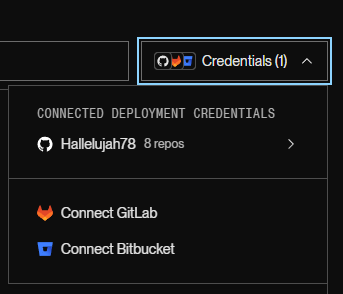
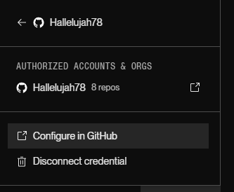
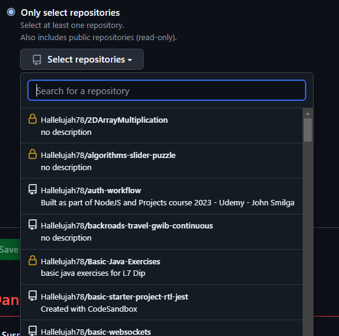

# Deploying a basic flask app

- create new project in VSCode
- create a venv, activate and intall deps
  - py -m venv .venv
  - source .venv/Scripts/activate
  - pip install requests python-dotenv Flask
- create a git repo in your project
- add `static` and `templates` folders
- add a `styles` folder inside `static`
  - add `styles.css` to `styles\static\` and add your regular ol' CSS
- we store html files in `templates`
- create index.html inside templates
  - curse VSCode since it won't provide HTML intellisense inside the templates folder
- add a link inside index.html for your stylesheet (specific to Flask):

```html
<link
  href="{{ url_for('static', filename='styles/style.css')}}"
  rel="stylesheet"
/>
```

- specific to this app, we add weather.py which provides functionality for our web app

```python
import os
from pprint import pprint
from dotenv import load_dotenv
import requests


# loads the environment variables
load_dotenv()


def get_current_weather(city="Dublin", country_code="IE"):
    request_url = f"https://api.openweathermap.org/data/2.5/weather?appid={os.getenv("API_KEY")}&q={city},{country_code}&units=metric"

    weather_data = requests.get(request_url).json()

    return weather_data


if __name__ == "__main__":
    print("\n*** Get Current Weather Conditions ***")
    city = input("\nPlease enter a city name: ")
    country = input("\nPlease enter a 2-letter country code: ")
    weather_data = get_current_weather(city, country)

    print("\n")
    pprint(weather_data)
```

- we also add server.py which sets up the Flask server

```python
# server.py or main.py is a common name for the server/main module in a flask web app
from flask import Flask, render_template, request
from weather import get_current_weather

# make your app a Flask app
app = Flask(__name__)


# routes in Flask
@app.route("/")  # home page
# frequently, will access home page if you go to '/index' or '/index.html'
@app.route("/index")

# define a function that returns something for the route
def index():
    return "Hello World!"


# make it a module
if __name__ == "__main__":
    # run on locahost port 8000
    app.run(host="0.0.0.0", port=8000)
```

- at this point, we can run the server by simply running our server.py file as main (ctrl+shift+n in vscode inside server.py)
- we can see our web app at localhost:8000 or at 'ip.of.dev.machine:8000'
- fix this warning `WARNING: This is a development server. Do not use it in a production deployment. Use a production WSGI server instead` by installing `waitress`
- waitress serves our web app in production
  - new dependency, must recreate requirements file: pip freeze > requirements.txt
- add following to top of `server.py`

```python
from waitress import serve
```

- change `app.run(host="0.0.0.0", port=8000)` to:

```python
serve(app, host="0.0.0.0", port=8000)
```

- note, we add `app` to the args

- copy everything in index.html to a new file in `templates` named `weather.py`
- we update the title

```html
<title>{{title }} ({{country}}) Weather</title>
```

- now the city will be substituted for the title when we run our app
- in the body we update the h1 and add some other template related content

```html
<body>
  <h1>{{title }} ({{country}}) Weather</h1>
  <p>{{status}} and {{temp}}&deg;</p>
  <p>Feels like {{feels_like}}&deg;</p>
</body>
```

- when we submit our form, we are redirected to the `/weather` route, but we're not handling that in our server.py file yet

```html
<form action="/weather"></form>
```

- add a function to server.py to get the form data and return a template

```python
def get_weather():
    # get the form data - city
    city = request.args.get("city")
    # get form data - country
    country = request.args.get("country")
    # get the weather data using our weather.py function
    weather_data = get_current_weather(city, country)
    # return our template to render
    return render_template(
        "weather.html", # the target
        title=weather_data["name"], # title is the name in our weather.html page
        country=country,
        status=weather_data["weather"][0]["description"].capitalize(),
        temp=f"{weather_data['main']['temp']:.1f}", # f string for formatting
        feels_like=f"{weather_data['main']['feels_like']:.1f}", # f string for formatting
    )
```

- update the index function in server.py so it returns something useful (not `hello world`!)

```python
def index():
    return render_template("index.html")
```

- now we can run our app and it works!
- still some issues, empty input causes an error and if a location doesn't exist then the server falls over since we're trying to access weather_data['name'] when weather data is probably an error from the server
- update our weather module so default values are added if the user doesn't input anything

```python
# check for empty string or string with only spaces
    if not bool(city.strip()):  # bool() is like an existence/null check
        city = "Kansas City"

    country = input("\nPlease enter a 2-letter country code: ")

    # check for empty string or string with only spaces
    if not bool(country.strip()):  # bool() is like an existence/null check
        country = "US"
```

- `bool()` returns false if `city` or `country` are empty strings, so `not bool()` returns true if the input is empty, and so the code in the if block is executed if the string is empty
- update our get_weather function in server.py with the same code to add default values

```python
def get_weather():
    # get the form data - city
    city = request.args.get("city")

    # check for empty string or string with only spaces
    if not bool(city.strip()):  # bool() is like an existence/null check
        city = "Kansas City"

    # get form data - country
    country = request.args.get("country")

    # check for empty string or string with only spaces
    if not bool(country.strip()):  # bool() is like an existence/null check
        country = "US"

    weather_data = get_current_weather(city, country)
```

- next we have to handle not found errors, where the city isn't in the weather_data json object
- entering nonsense at the command line we get

```json
{ "cod": "404", "message": "city not found" }
```

- in our successful request, the json object also has a `cod` prop, which is 200 (for success)
- we could look for a 200 code to know we can display the data
- add the following to server.py right after we make our request and get weather_data back

```python
# city not found by API
    if int(weather_data["cod"]) < 200 or int(weather_data["cod"]) > 299:
        return "City not found"
```

- this is temporary, but we add a `city-not-found.html` to templates to handle this

```html
<!DOCTYPE html>
<html lang="en">
  <head>
    <meta charset="UTF-8" />
    <meta name="viewport" content="width=device-width, initial-scale=1.0" />
    <title>City Not Found</title>
    <link
      href="{{ url_for('static', filename='styles/style.css')}}"
      rel="stylesheet"
    />
  </head>

  <body>
    <h1>City Not Found</h1>
    <h2>Try again?</h2>
    <form action="/weather">
      <input type="text" name="city" id="city" placeholder="Enter a City" />
      <input
        type="text"
        name="country"
        id="country"
        placeholder="Enter a 2-letter country code"
      />
      <button type="submit">Submit</button>
    </form>
  </body>
</html>
```

- update so we're don't just return a string "City not found":

```python
 # city not found by API
    if int(weather_data["cod"]) < 200 or int(weather_data["cod"]) > 299:
        return render_template("city-not-found.html")
```

- next we deploy on render.com
- create a new web service on render
- click on credentials and select your github account (assuming already connected to render)



- click on `configure in github`
  
- in GitHub, add the repo you want to allow Render to access and hit `connect`



- this brings you to the web app deployment page on Render
- you can change the name of the service to something appropriate
- update the build command, by default it is: `pip install -r requirements.txt`
- change this to:

```bash
pip install -U pip && pip install -r requiremets.txt
```

- set the start command to: `python3 server.py`
- make sure you're using the free instance
- add the environment variable (weather api key) in advanced options
- must also add the python version as an environment variable for Render: `PYTHON_VERSION` and value is `3.12.3`
- you can get python version by typing `py --version` in terminal in VSCode
- click `Deploy Web Service' in Render
